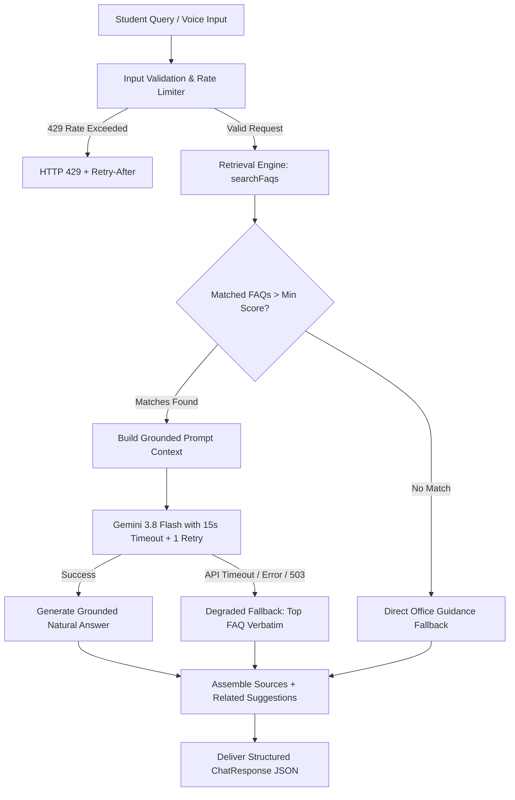

<div align="center">

# 🎓 Campus FAQ Assistant

**A Production-Grade, AI-Powered Campus Concierge & RAG Assistant for College Students**

[](https://nextjs.org/)
[](https://react.dev/)
[](https://www.typescriptlang.org/)
[](https://ai.google.dev/)
[](https://tailwindcss.com/)
[](https://zod.dev/)
[](https://vitest.dev/)
[](https://eslint.org/)

<p align="center">
  <a href="#key-features">Key Features</a> •
  <a href="#system-architecture">Architecture</a> •
  <a href="#api-reference">API Reference</a> •
  <a href="#getting-started">Getting Started</a> •
  <a href="#project-structure">Project Structure</a> •
  <a href="#testing">Testing</a>
</p>

</div>

---

## 🌟 Overview

The **Campus FAQ Assistant** is built to solve the onboarding friction faced by first-year college students. Navigating university policies, library rules, club memberships, hostel in-times, and campus facilities can be overwhelming.

This application combines a verified, structured campus knowledge base with **Google Gemini 3.8 Flash** using a hardened **Retrieval-Augmented Generation (RAG)** pipeline to deliver instant, friendly, and hallucination-free answers.

---

## 🚀 Key Features

- 🧠 **Grounded RAG Pipeline**: Never hallucinates. Answers are synthesized strictly from verified campus knowledge base entries.
- ⚡ **Graceful Degradation ("Quick Answer Mode")**: If the LLM experiences latency, downtime, or rate limits, the system automatically falls back to verbatim verified FAQ answers.
- 🔍 **Multi-Factor Keyword & Token Ranking**: Custom retrieval matcher combining exact phrase weighting (+100), keyword tokens (+40), token overlap, category boosts, and stopword filtering.
- 🎙️ **Web Speech Voice-to-Text**: Built-in voice input supporting Indian English (`en-IN`) with real-time transcription and visual recording indicators.
- 🏷️ **Interactive Category Exploration**: Instant filtering across **Academics**, **Clubs & Societies**, **Library**, **Events**, **Timings**, and **Campus Facilities**.
- 🛡️ **Sliding Per-IP Rate Limiter**: Server-side in-memory rate limiting with HTTP `429 Too Many Requests` and standard `Retry-After` headers.
- 📚 **Transparent Source Citations**: Every assistant response displays verified source badges linking directly to reference FAQ documents.
- ♿ **Accessible & Mobile-First**: Built with full ARIA live regions, keyboard navigation support, and responsive desktop-centered layouts.

---

## 🏗️ System Architecture



---

## 📡 API Reference

All endpoints return uniform, typed JSON responses and enforce schema validation with Zod.

| Method | Endpoint | Description | Query / Body Parameters |
|---|---|---|---|
| `GET` | `/api/health` | Service health status | None |
| `GET` | `/api/faqs` | Retrieve curated FAQ list | `?category=library` *(optional)* |
| `GET` | `/api/suggestions` | Get dynamic suggested questions | `?category=academics` *(optional)* |
| `POST` | `/api/chat` | Main AI RAG generation endpoint | `{ "message": string, "category"?: string, "history"?: ChatMessage[] }` |

### Sample `POST /api/chat` Request

```bash
curl -X POST http://localhost:3000/api/chat \
  -H "Content-Type: application/json" \
  -d '{
    "message": "Where is the central library and how many books can I borrow?",
    "category": "library"
  }'
```

### Sample Response

```json
{
  "reply": "The Central Library is located in Block B. Undergraduate students are permitted to borrow up to 4 books for a period of 14 days using their Student ID card.",
  "category": "library",
  "sources": ["lib-001"],
  "suggestions": [
    "What are the library overdue fines and renewal policies?",
    "How do I access IEEE, Springer, and digital journals from off-campus?"
  ],
  "degraded": false
}
```

---

## 📂 Project Structure

```
campus-faq-assistant/
├── src/
│   ├── app/
│   │   ├── api/
│   │   │   ├── chat/route.ts          # Main RAG & Gemini completion endpoint
│   │   │   ├── faqs/route.ts          # Curated FAQ query endpoint
│   │   │   ├── suggestions/route.ts   # Dynamic question suggestions
│   │   │   └── health/route.ts        # Health check endpoint ({ status: "ok" })
│   │   ├── globals.css                # Tailwind base & custom styles
│   │   ├── layout.tsx                 # Root layout & SEO metadata
│   │   └── page.tsx                   # Interactive chat application shell
│   ├── components/
│   │   ├── CategoryChips.tsx          # Horizontally scrollable category pills
│   │   ├── ChatEmptyState.tsx         # Welcome banner & suggested prompt cards
│   │   ├── ChatInput.tsx              # Input bar with Web Speech voice toggle
│   │   ├── ChatMessageItem.tsx        # Chat bubbles with source badges & suggestions
│   │   └── Header.tsx                 # Header with title & clear history button
│   ├── hooks/
│   │   └── useSpeechRecognition.ts    # Web Speech API speech-to-text hook
│   ├── data/
│   │   ├── categories.json            # 6 campus category definitions
│   │   └── faqs.json                  # Curated Indian campus FAQ seed data
│   ├── lib/
│   │   ├── ai/
│   │   │   ├── client.ts              # Google GenAI singleton & grounded executor
│   │   │   └── prompts.ts             # Strict anti-hallucination prompt templates
│   │   ├── config/
│   │   │   └── env.ts                 # Type-safe environment validation
│   │   ├── retrieval/
│   │   │   └── matcher.ts             # Multi-factor token & keyword scoring
│   │   ├── utils/
│   │   │   └── index.ts               # Standard API response formatting & cn()
│   │   └── validation/
│   │       └── schemas.ts             # Zod validation schemas
│   └── types/
│       └── index.ts                   # Domain TypeScript models
├── tests/
│   ├── retrieval.test.ts              # Retrieval ranking & threshold unit tests
│   └── chat-fallback.test.ts          # Graceful degradation & API fallback tests
├── .env.example                       # Environment template
├── tailwind.config.ts                 # Tailwind configuration
├── tsconfig.json                      # Strict TypeScript configuration
├── vitest.config.ts                   # Test runner configuration
└── README.md
```

---

## 🛠️ Getting Started

### 1. Prerequisites

- [Node.js](https://nodejs.org/) v18.17+ or v20+
- `npm` (v9+)
- A [Google Gemini API Key](https://aistudio.google.com/)

### 2. Clone and Install

```bash
git clone https://github.com/krix2112/ai-campus-assistant.git
cd ai-campus-assistant
npm install
```

### 3. Configure Environment

Create a `.env.local` file in the root directory:

```bash
cp .env.example .env.local
```

Fill in your configuration:

```env
GEMINI_API_KEY=your_google_gemini_api_key_here
GEMINI_MODEL=gemini-3.8-flash
RATE_LIMIT_PER_MINUTE=60
```

### 4. Start Development Server

```bash
npm run dev
```

Open [http://localhost:3000](http://localhost:3000) in your browser.

---

## 🧪 Testing & Quality Assurance

```bash
# Run TypeScript typecheck (strict mode)
npm run typecheck

# Run ESLint code quality checks
npm run lint

# Run Vitest test suite
npm run test

# Production build validation
npm run build
```

---

## 🛡️ Security & Privacy

- **Server-Side AI SDK**: The Gemini API key is accessed strictly within server-side API routes and is never exposed to client bundles.
- **Prompt Injection Defense**: The system prompt explicitly instructs the LLM to ignore user attempts to override instructions or trigger roleplay exploits.
- **In-Memory Rate Limiting**: Protects backend resources against automated abuse.

---

## 📄 License

This project is licensed under the [MIT License](LICENSE).
